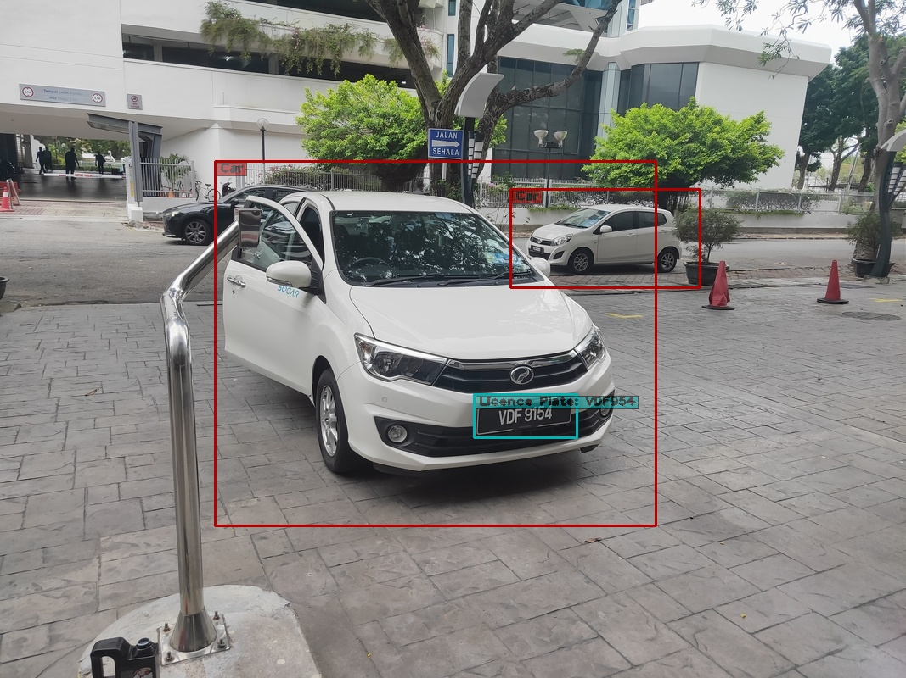

# Cargate Project Implementation
#### The system is built using yolov5 (objects detector) [Reference 1] and PaddlePaddle OCR (license plate recognition) [Reference 2]

It will be used to detect vehicles including Cars and Vans and send the NumberPlate detections over to a FastAPI backend server which will perform the License Plate Recognition (LPR) and allow the access to authorized vehicles.

#### Run the Backend Server
Before running the project, make sure to first setup the FastAPI backend server, to do so please refer to the following [server instructions](Kraftboard-Fastapi/README.MD).

#### This project can be run on both a PC 💻 as well as on a Jetson Nano 📼    
- To Run the Cargate project on a PC, please refer to the following [PC instructions](Carplate-yolov5/README.md).
- To Run the Cargate project on a Jetson Nano, choose from the following two options:   
  - [Run Cargate on Jetson Nano without Docker](#run-cargate-on-jetson-nano-without-docker-)
  - [Run Cargate on Jetson Nano with Docker](#run-cargate-on-jetson-nano-with-docker-)

<br />

## Run Cargate on Jetson Nano without Docker 🐳❌
The Following scripts were tested on a Jetson Nano with **JetPack 4.5** image flashed. To download Jetpack 4.5, refer to the following [link](https://developer.nvidia.com/jetpack-sdk-45-archive).

### Install torch and torchvision libraries
```
./install_torch.sh
```

### Install additional libraries
```
pip3 install -r Carplate-yolov5/requirements-nano.txt
```

### Download weights
```
gdown https://drive.google.com/uc?id=18tyNWkGC_x9FddZ9hJ5di3_Sc9WPkpd_ -O Carplate-yolov5/yolov5/weights/detection.pt
```

### Run Inference
Detect vehicles using the CSI Camera and send NumberPlate detections over to a FastAPI backend server to perform LPR.
```
python3 Carplate-yolov5/main.py --show --nano
```

<br />

## Run Cargate on Jetson Nano with Docker 🐳
The Following scripts were tested on a Jetson Nano with **JetPack 4.5** image flashed. To download Jetpack 4.5, refer to the following [link](https://developer.nvidia.com/jetpack-sdk-45-archive).

### Change Docker Default Runtime
This sets ```"default-runtime": "nvidia"``` in ```/etc/docker/daemon.json```
```
./setup.sh
```

### Build the Docker Image 
Note: This should take approximately 3-4 hours to complete
```
./build.sh
```

### Run Inference
Detect vehicles using the CSI Camera and send NumberPlate detections over to a FastAPI backend server to perform LPR.
```
./run.sh
```

<br />

## **Demo**


<br />

## External Hardware Circuit Diagram

There are few exxternal hardware used in this project:
1) **4GB Nvidia Jetson Nano Developer Kit (B01)**: Edge Device used for running inference of the Cargate Project. [(link)](https://my.cytron.io/p-jetson-nano-basic-kit-64gb-microsd-and-power-adapter?r=1&gclid=CjwKCAjw9uKIBhA8EiwAYPUS3BZKu662BgpNuxkQ-N37AZnbsdjGnrkmls9kMq9PYegSqjzvAXJ03hoCNrQQAvD_BwE)   
2) **IMX219-77 CSI Camera**: Used for obtaining input image frames to be fed into the Neural Network. [(link)](https://www.waveshare.com/product/ai/cameras/single-cameras/imx219-77-camera.htm)  
3) **1 CH Active H/L 5V Relay Module**: Used to control the gate and grant access to authorized vehicles. [(link)](https://my.cytron.io/p-1ch-active-h-l-5v-optocoupler-relay-module?search=single%20channel&description=1)  
4) **JSN-SR04T Waterproof Ultrasonic Module**: Used to determine if vehicle is present before starting detection. [(link)](https://my.cytron.io/p-waterproof-ultrasonic-module?r=1&gclid=CjwKCAjw9uKIBhA8EiwAYPUS3LeC40Laj_BcDWOXrLwl_AcSGEV3mtbL0mmIaJUx3kVsCiK8A4RYABoC9g4QAvD_BwE)            
5) **CH340 Arduino Uno**: Used to obtain ultrasonic sensor reading and send it to the Jetson Nano via I2C. [(link)](https://my.cytron.io/p-uno-compatible-ch340-with-usb-cable?r=1&gclid=CjwKCAjw9uKIBhA8EiwAYPUS3EGIYHRe9-xZTnu5T9eceew3vJHvf_FrQNoBL1TUkrDhJwTzinCXYhoCtxsQAvD_BwE)   
6) **LED Panel**: Used to display the Number Plate of authorized vehicles on an LED Panel. [(link)]()


<br />

## Appendix

There are 2 ways that you can use to run shell scripts on Linux:
```
1) By using the bash command:   
$ bash ./scriptname.sh   

2) By making the script executable (To be performed only once):        
$ chmod +x scriptname.sh   

Then run the script normally using the command:   
$ ./scriptname.sh      
```

<br />

## **References**
#### 1. https://github.com/ultralytics/yolov5
#### 2. https://github.com/PaddlePaddle/PaddleOCR 
#### 3. https://github.com/otamajakusi/dockerfile-yolov5-jetson
